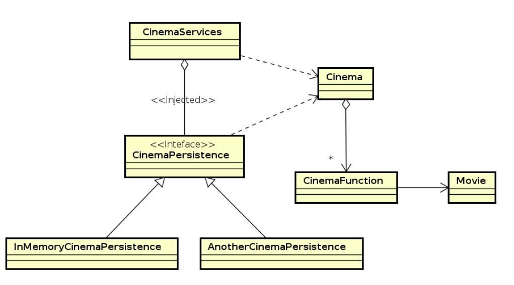
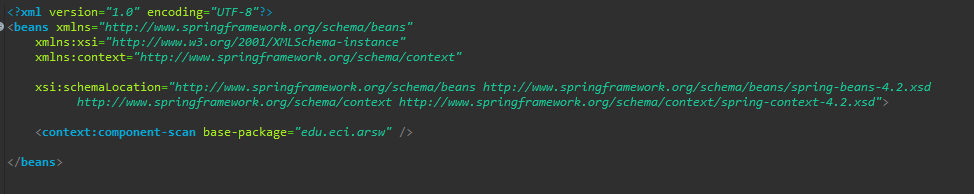
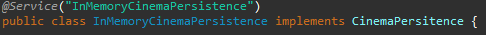

## Cinema Book System

## Description

In this exercise we will build a class model for the logical layer of an application that allows managing the sale of cinema tickets for a prestigious company.

1. Configure the application to work under a dependency injection scheme, as shown in the previous diagram. The above requires:

	1. Add the dependencies of Spring.

	

	2. Add the Spring configuration.	

	3. Configure the application -by means of annotations- so that the persistence scheme is injected at the moment of creation of the 'CinemaServices' bean.

2. Complete the getCinemaByName (), buyTicket (), and getFunctionsbyCinemaAndDate () operations. Implement everything required from the lower layers (for now, the available persistence scheme 'InMemoryCinemasPersistence') by adding the corresponding tests in 'InMemoryPersistenceTest'.

3. For later queries, we want to implement two functionalities:
	1. A method 'getFunctionsbyCinemaAndDate' that allows to obtain all the functions of a certain cinema for a certain date. 
	
	
	
	2. Allow the purchase or reservation of tickets for a certain position of chairs in the room through the 'buyTicket' method.
	
	

4. Make a program in which you create (through Spring) an instance of CinemaServices, and rectify the functionality of it: register cinemas, consult cinemas, obtain the functions of certain cinema, buy / book tickets, etc.

 
5. It is wanted that the consultations realize a filtering process of the films to exhibit, said filters look for to give him the facility to the user to see the most suitable films according to his necessity. Adjust the application (adding the abstractions and implementations that you consider) so that the CinemaServices class is injected with one of two possible 'filters' (or possible future filters). The use of more than one at a time is not contemplated:

	- (A) Filtered by gender: Allows you to obtain only the list of the films of a certain genre (of a certain cinema and a certain date) (The genre enters by parameter). 
	
	

	- (B) Filtering by availability: Allows you to obtain only the list of films that have more than x empty seats (of a certain cinema and a certain date) (The number of 	se- ats is entered per parameter).
	
	

6. Add the corresponding tests to each of these filters, and test their operation in the test program, verifying that only by changing the position of the annotations -without changing anything else-, the program returns the list of films filtered in the manner (A ) or in the way (B).

