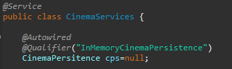

## Cinema Book System

## Description

In this exercise we will build a class model for the logical layer of an application that allows managing the sale of cinema tickets for a prestigious company.

1. Configure the application to work under a dependency injection scheme, as shown in the previous diagram. The above requires:

1. Add the dependencies of Spring.

2. Add the Spring configuration.

3. Configure the application -by means of annotations- so that the persistence scheme is injected at the moment of creation of the 'CinemaServices' bean.

2. Complete the getCinemaByName (), buyTicket (), and getFunctionsbyCinemaAndDate () operations. Implement everything required from the lower layers (for now, the available persistence scheme 'InMemoryCinemasPersistence') by adding the corresponding tests in 'InMemoryPersistenceTest'.

3. For later queries, we want to implement two functionalities:
1. A method 'getFunctionsbyCinemaAndDate' that allows to obtain all the functions of a certain cinema for a certain date. 
2. Allow the purchase or reservation of tickets for a certain position of chairs in the room through the 'buyTicket' method.

 4. Make a program in which you create (through Spring) an instance of CinemaServices, and rectify the functionality of it: register cinemas, consult cinemas, obtain the functions of certain cinema, buy / book tickets, etc.